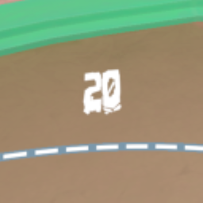

# Health Display With Font

## Instructions
1. Install [MelonLoader](https://github.com/LavaGang/MelonLoader)
2. Run RUMBLE without mods
3. Drop Mods from .zip into RUMBLE's installation folder
4. Drop UserData from .zip into RUMBLE's installation folder
5. Play RUMBLE!

## Add your own font
1. Install Unity Hub
2. Go to Installs, Install Editor, Archive, Download Archive, 2022 (depends on current rumble version), All versions, 2022.1.13f1 (or whatever the current rumble version is), Install.
3. In Unity Hub, go to Projects, New Project, change the editor version at the top, select 3D (Built-In Render Pipeline), and create the project.
4. Follow [this video](https://www.youtube.com/embed/GTe1Aepl0p4?end=70) until 1:10.
5. The folder 'mynewbundle' should be named 'fontbundle' instead.
6. Go into the folder and put your .ttf or .otf inside. Make sure the name is either 'font.ttf' or 'font.otf'.
7. Follow [this video](https://www.youtube.com/embed/GTe1Aepl0p4?start=95&end=142) until 2:22. Any steps in the video performed on 'ThreeCapsules' should be performed on your font file. Make sure that whenever the video uses 'mynewbundle', you use 'fontbundle'.
8. Copy the file named 'fontbundle' with no file extention. Paste it into RUMBLE's UserData\HealthDisplayWithFont folder.

## Help And Other Resources
Get help and find other resources in the [Modding Discord](https://discord.gg/fsbcnZgzfa)

## Default font credit
- [SDRAWKCABMIAY's video](https://youtu.be/wp4VaVm_XpI)
- [File link](https://drive.google.com/drive/folders/1-Wr4TW4FVQ8j8EyKAMHPa-D2Srg05Fyk)

